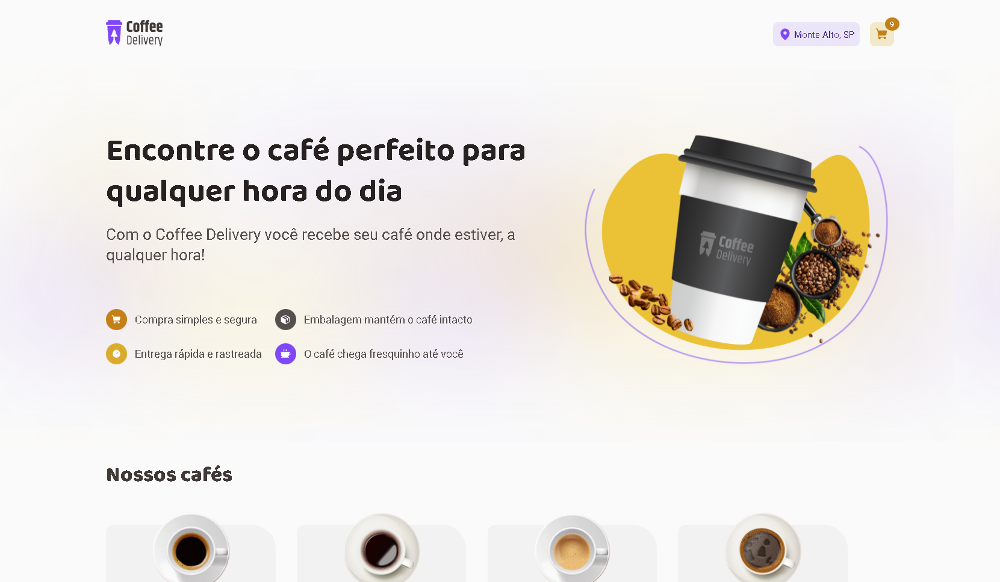
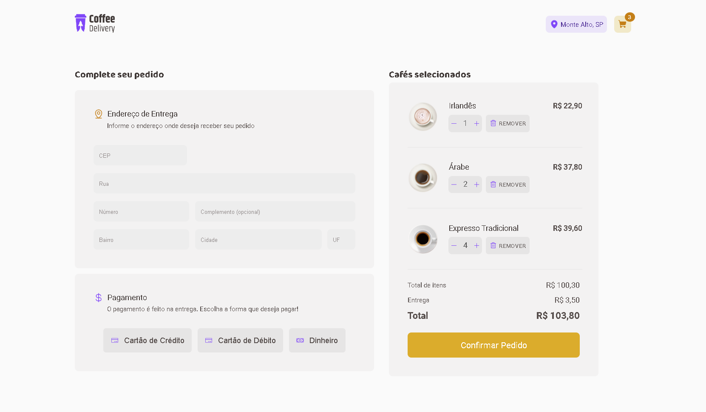
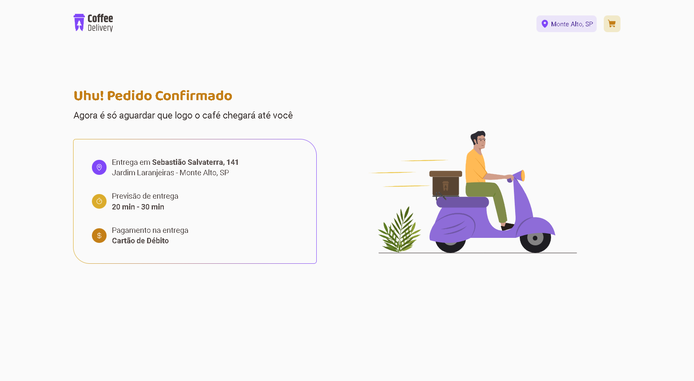

# Coffee Delivery

    
    
    

    

> Trilha Ignite

Segunda desafio desenvolvido na trilha Ignite da Rocketseat com ReactJS, Styled-Components e TypeScript. A ideia foi criar uma aplicação de Delivery onde a pessoa poderá escolher quais tipos diferentes de cafés quer receber direto na sua casa, com as quantidades de cada café, o endereço e a forma de pagamento.
Além de todos os fundamentos do React, foi utilizado ContextAPI para compartilhar os dados entre as rotas, um pouco de hooks, e para a estilização foi aplicado o Styled-Components. Também fui um pouco além, já que não fazia parte do desafio, e deixei a aplicação responsiva para o mobile.

Second challenge developed on Rocketseat's Ignite track with ReactJS, Styled-Components and TypeScript. The idea was to create a Delivery application where the person can choose which different types of coffees they want to receive directly at their home, with the quantities of each coffee, the address and the payment method.
In addition to all React fundamentals, ContextAPI was used to share data between routes, a little hooks, and Styled-Components was applied for styling. I also went a little further, as it was not part of the challenge, and left the mobile app responsive.

## 🛠 Technologies

- React
- React-Router-Dom
- TypeScript
- Styled-Components

## 🧑‍💻 Applications

- React Hooks
- React Router
- Context API
- immutability
- Components
- Typing with typescript
- Styled-Components

## 💛 Contact

- Email --> luca.boer@outlook.com
- Linkedin --> https://www.linkedin.com/in/luca-destefano-boer-99674121b/
